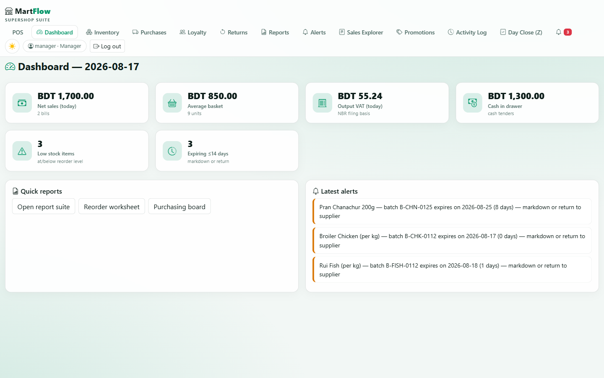
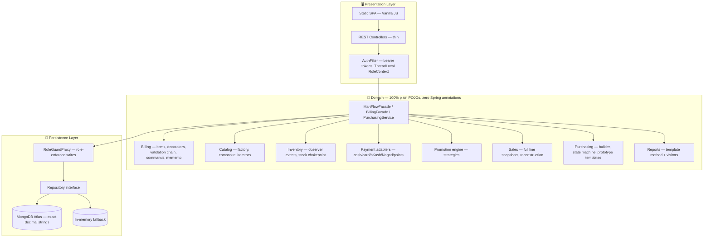
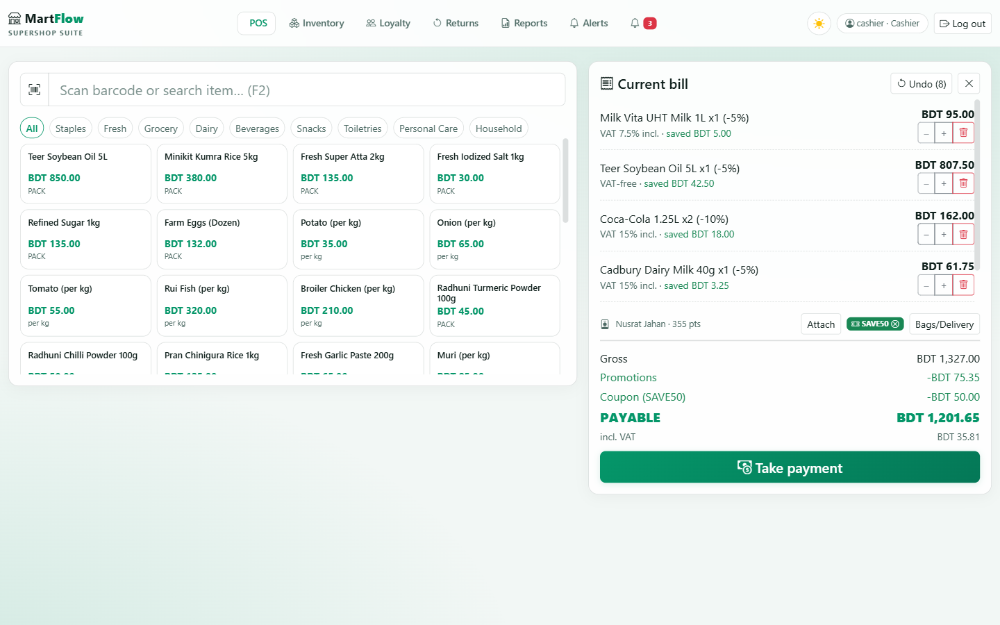
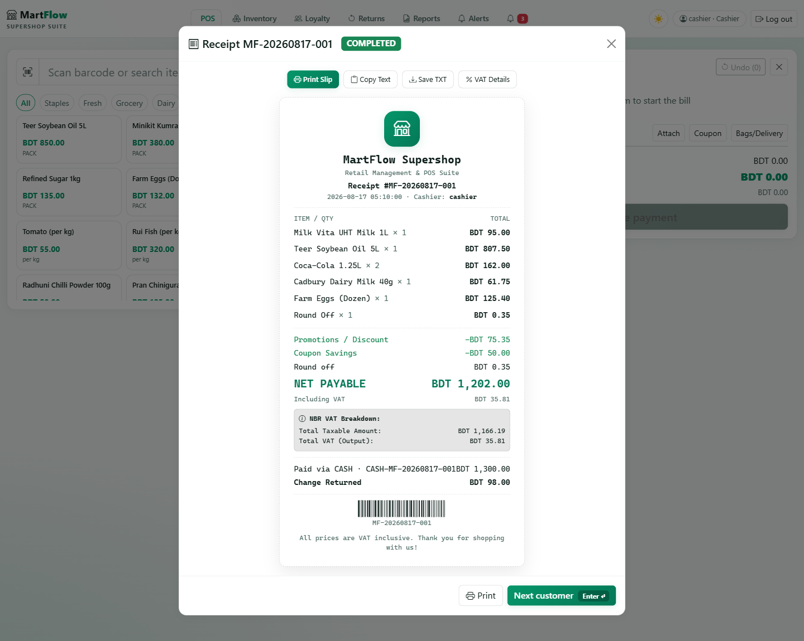
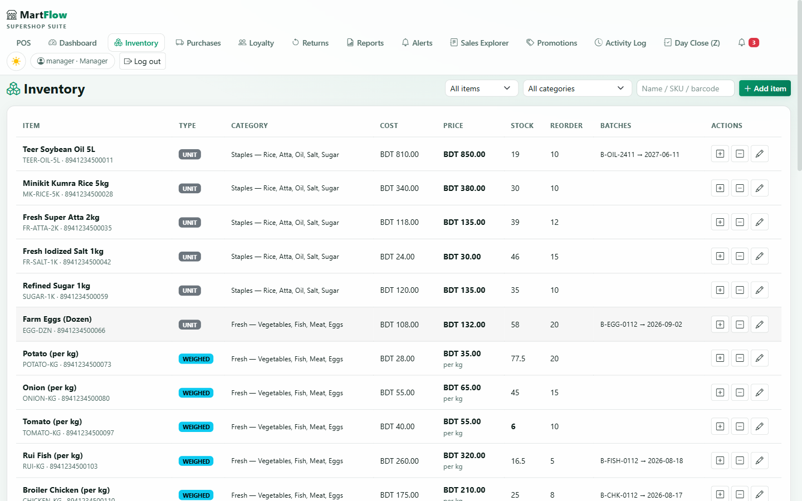
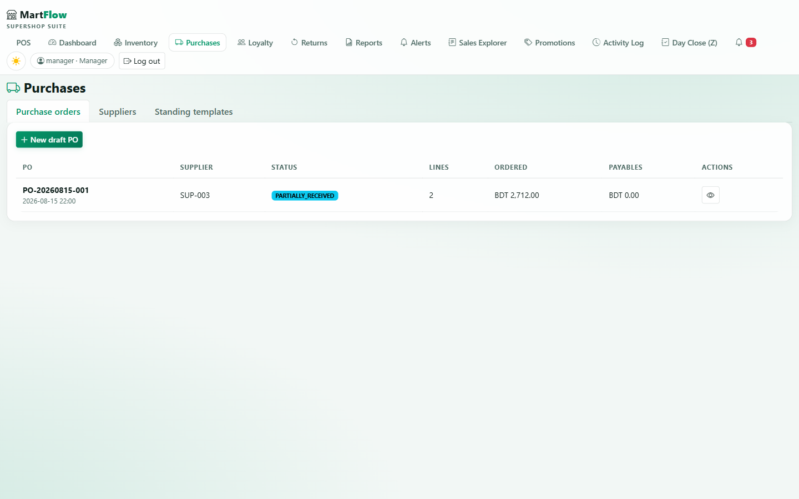
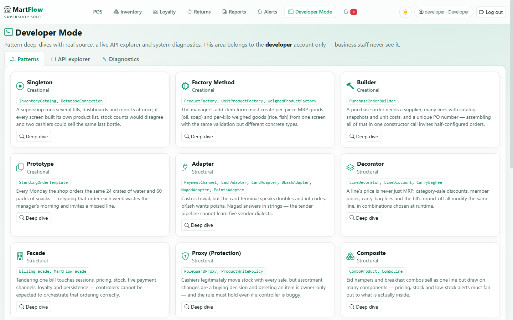
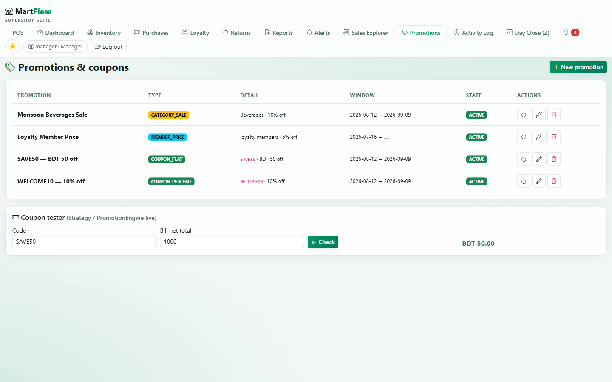
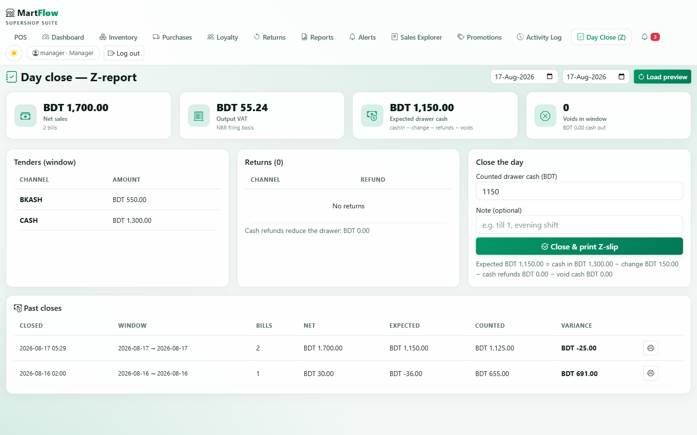
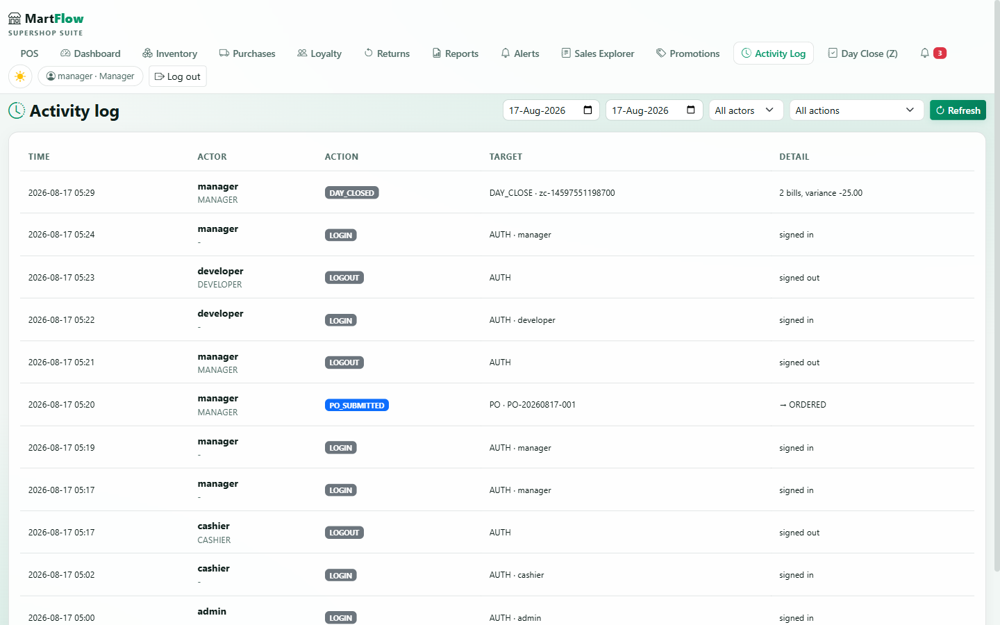

<div align="center">

<h1>🛒 MartFlow</h1>
<h3>Supershop Retail Management Suite for Bangladesh</h3>

<p>
  
  
  
  
  
  
</p>

<p>
  <strong>POS · Inventory · Purchasing · Loyalty · Returns · NBR VAT Reports</strong><br/>
  A complete retail management system for Bangladeshi supershops,<br/>
  built in plain Java with <strong>18 real GoF design patterns</strong> doing real work in the money path.
</p>



</div>

---

## 📋 Table of Contents

- [🎯 The Problem MartFlow Solves](#-the-problem-martflow-solves)
- [✨ Feature Modules](#-feature-modules)
- [🚀 Quick Start](#-quick-start)
- [🔐 Demo Accounts](#-demo-accounts)
- [🏗️ Architecture](#-architecture)
- [🧩 18 GoF Design Patterns](#-18-gof-design-patterns)
- [🌐 API Reference](#-api-reference)
- [📸 Screenshots](#-screenshots)
- [🔬 Quality Engineering](#-quality-engineering)
- [🗺️ Roadmap](#-roadmap)
- [👥 Contributors](#-contributors)
- [📄 License](#-license)

---

## 🎯 The Problem MartFlow Solves

Bangladeshi supershops (Shwapno, Meena Bazar, Unimart class — plus hundreds of mid-size local chains) run on a patchwork of systems:

> ❌ Imported POS software that **doesn't understand Bangladesh VAT**  
> ❌ Spreadsheets for purchasing  
> ❌ Notebooks for loyalty  
> ❌ Nothing at all for wastage

The owner finds out about problems **weeks late** — stock that walked out the door, batches that expired on the shelf, margins that quietly eroded.

**MartFlow is the single system a supershop branch actually needs.**

---

## ✨ Feature Modules

| Module | What the shop gets |
|:---|:---|
| 🧾 **POS Billing** | Barcode scanning, weighed goods (per kg), combos/hampers, split tenders (Cash / Card / bKash / Nagad / Loyalty Points), one-tap undo for mis-scans, printable thermal receipts |
| 📦 **Inventory** | Cost + MRP per item, batch & expiry tracking, reorder levels, low-stock and expiring views, damage/loss/theft write-offs (shrinkage tracking) |
| 🛍️ **Purchasing** | Suppliers with payment terms, purchase orders with a guarded lifecycle, goods receipts, payables, **weekly restock templates** (clone → adjust → submit) |
| 🎁 **Promotions** | Date-windowed category sales, loyalty member pricing, coupon codes — full manager CRUD + a live coupon tester |
| 🏆 **Loyalty** | Members by phone, points earned per 100 BDT, redeemed as tender at the till |
| 🔄 **Returns** | Partial per-line returns with pro-rata refunds, void with full reversal, exchange = return + new bill |
| 🔍 **Sales Explorer** | Manager view over every receipt: date/status/cashier filters, one-click reprint, void with required reason |
| 📊 **Day Close (Z-Report)** | End-of-shift drawer reconciliation — per-tender split, expected vs counted cash, variance, printable Z-slip |
| 🔒 **Activity Log** | Append-only audit trail: every login, void, return, shrinkage, price edit, PO move — _"ke void dilam?"_ has an answer |
| 📈 **Reports** | Daily sales, best sellers, reorder worksheet, wastage watch, staff performance, **profit**, and **NBR VAT summary** — exportable to CSV |
| 👨‍💻 **Developer Mode** | 18 pattern deep-dives with real source snippets, live API explorer (try-it with your own token), system diagnostics — visible **only** to the developer account |
| 🛡️ **Access Control** | PBKDF2-hashed passwords, bearer tokens, four roles: Owner / Manager / Cashier / Developer |

> 💡 Everything persists to **MongoDB Atlas** (with zero-config in-memory fallback for demos). Every money figure is exact-decimal `BigDecimal` — VAT-inclusive, back-calculated per NBR rate slab **(0% / 7.5% / 15%)**.

---

## 🚀 Quick Start

**Requirements:** JDK 17+ — Maven wrapper included, no Maven install needed.

```powershell
# Clone the repository
git clone https://github.com/MHMITHUN/MartFlow-Supershop-POS.git
cd MartFlow-Supershop-POS

# Run in in-memory mode — zero setup required
.\mvnw.cmd spring-boot:run

# Open in browser
start http://localhost:8080
```

> 🌱 **First boot** seeds a realistic BD shelf (Teer, Fresh, Pran, Radhuni, Miner…), 3 distributors, active promotions, 5 loyalty members and a purchase order already on its way — so every screen has something real to show.

### ☁️ Optional: Persistent Storage (MongoDB Atlas)

Create a free Atlas cluster, then set `MONGODB_URI` as an env var or in a `.env` file:

```env
MONGODB_URI=mongodb+srv://<user>:<password>@cluster.mongodb.net/martflow
```

No URI? Everything still runs in-memory seamlessly.

### 🧪 Run Tests

```powershell
.\mvnw.cmd clean test
# 167 tests — fully hermetic (no real DB is ever touched)
```

---

## 🔐 Demo Accounts

Seeded on first boot — **change before any real use!**

| 👤 Username | 🔑 Password | 🎭 Role | Capabilities |
|:---:|:---:|:---:|:---|
| `admin` | `admin123` | 👑 **Owner** | Everything, including staff accounts & item deletion |
| `manager` | `manager123` | 🏪 **Manager** | Catalog edits, purchasing, financial reports, voids, day close |
| `cashier` | `cashier123` | 💳 **Cashier** | Billing, returns, operational views |
| `developer` | `developer123` | 🧑‍💻 **Developer** | Till-side screens + Developer Mode (patterns / API explorer / diagnostics) — no business power |

---

## 🏗️ Architecture



| Rule | Detail |
|:---|:---|
| 🏛️ **Layer Rule** | Domain is 100% plain POJOs — Spring appears only in one `@Configuration` and thin HTTP controllers |
| 💰 **Money Rule** | Every amount is `BigDecimal` (2dp, HALF_UP), persisted as exact decimal strings |
| 🕐 **Time Rule** | All business dates flow through `TimeSource` pinned to **Asia/Dhaka** |
| 💾 **Durability** | Stock, sales, customers, promotions, POs, suppliers and users all persist to Atlas when configured |

---

## 🧩 18 GoF Design Patterns

> A pattern earns its place **only by carrying a real feature**. Three patterns that were dead code in the old storefront (Prototype, TaxVisitor, the customer Observer) are now load-bearing.

<details>
<summary><b>🏗️ Creational Patterns (4)</b></summary>

| # | Pattern | Where | Why the business needs it |
|:---:|:---|:---|:---|
| 1 | 🔵 **Singleton** | `catalog/InventoryCatalog`, `persistence/DatabaseConnection` | One stock truth per process — two catalogs would oversell the same shelf |
| 2 | 🏭 **Factory Method** | `catalog/ProductFactory` → `UnitProductFactory`, `WeighedProductFactory` | The "add item" form creates per-piece and per-kg items through one path |
| 3 | 🔨 **Builder** | `suppliers/PurchaseOrderBuilder` | A PO is assembled step by step; no half-configured order can escape into the workflow |
| 4 | 📋 **Prototype** | `suppliers/StandingOrderTemplate` | The weekly restock list is a template — _clone into draft, adjust, submit_ (2 clicks instead of 15) |

</details>

<details>
<summary><b>🏛️ Structural Patterns (5)</b></summary>

| # | Pattern | Where | Why the business needs it |
|:---:|:---|:---|:---|
| 5 | 🔌 **Adapter** | `payment/` — Cash, Card, Bkash, Nagad, Points adapters | Five very different tender channels behind one `PaymentChannel` port; the till never branches on payment type |
| 6 | 🎀 **Decorator** | `billing/decorator/` — LineDiscount, CarryBagFee, DeliveryFee, RoundOffAdjustment | Promotions and charges stack on any bill line without touching line classes |
| 7 | 🚪 **Facade** | `app/MartFlowFacade`, `billing/BillingFacade` | Every UI button is one call; controllers stay dumb and testable |
| 8 | 🛡️ **Proxy** | `persistence/proxy/RoleGuardProxy` | A cashier cannot create/delete catalog items _even through a buggy endpoint_ |
| 9 | 🌳 **Composite** | `catalog/ComboProduct` | An Eid hamper is priced and stocked from its components; selling one consumes each component truthfully |

</details>

<details open>
<summary><b>⚡ Behavioral Patterns (9)</b></summary>

| # | Pattern | Where | Why the business needs it |
|:---:|:---|:---|:---|
| 10 | 👀 **Observer** | `inventory/` — AlertService, ReorderSuggestionObserver, ExpiryWatcher | Low stock and near-expiry batches raise alerts by themselves; low stock even drafts the reorder suggestion |
| 11 | ♟️ **Strategy** | `pricing/` — RegularPrice, CategorySale, MemberPrice + `PromotionEngine` | Managers switch promotions on/off per date window; the till's pricing code never changes |
| 12 | ⚡ **Command** | `billing/commands/` + void/return pipelines | A declined card **rolls back stock, points and the sale itself**, in reverse order — atomically |
| 13 | 📐 **Template Method** | `reports/AbstractReportGenerator` + 8 concrete reports | A new report is 3 hooks; "VOIDED never counts as revenue" is decided exactly once |
| 14 | ⛓️ **Chain of Responsibility** | `billing/validation/` — 6 ordered rules | The cashier sees the _exact first_ failing rule (empty bill → weighment → stock → coupon → loyalty → tender) |
| 15 | 🔄 **State** | `suppliers/postate/` — 6 purchase-order states | A draft PO physically cannot be received; a closed one cannot be cancelled |
| 16 | 🔬 **Visitor** | `reports/visitor/` — VatVisitor, ProfitVisitor, ReceiptFormatterVisitor | The same bill lines feed NBR VAT filing, margin analysis and receipt layout |
| 17 | 💾 **Memento** | `billing/BillMemento` (per-session undo stack) | Mis-scans happen every minute at a real till; the cashier's Undo is a money feature |
| 18 | 🔁 **Iterator** | `catalog/iter/` — InStock, LowStock, ExpiringSoon, PriceRange | The low-stock _view_ and the low-stock _report_ walk the same iterator — they can never disagree |

</details>

> **💡 One deliberate asymmetry:** POS sale status is a plain enum while purchase orders get the full State pattern. Patterns follow the domain, not the syllabus.

---

## 🌐 API Reference

All endpoints under `/api` — bearer token required except login.

<details>
<summary><b>📋 Click to expand the complete endpoint list</b></summary>

| Area | Endpoints |
|:---|:---|
| 🔐 **Auth** | `POST /auth/login` · `POST /auth/logout` · `GET /auth/me` |
| 👥 **Staff** (admin) | `GET/POST /users` · `PUT /users/{id}` |
| 📦 **Catalog** | `GET /products?q&categoryId&view=in_stock\|low_stock\|expiring&days&maxPrice` · `GET /products/{id}` · `GET /products/barcode/{code}` · `GET /categories` · `POST/PUT /products/{id}` (manager+) · `DELETE` (admin) |
| 🧾 **POS Bill** | `GET /bill` · `POST /bill/lines` · `PUT/DELETE /bill/lines/{index}` · `DELETE /bill` · `POST /bill/undo` · `PUT /bill/customer` · `PUT /bill/coupon` · `PUT /bill/charges` · `POST /bill/tender` |
| 💰 **Sales** | `GET /sales?from&to&status&cashier` (manager+) · `GET /sales/{receiptNo}` · `POST /sales/{receiptNo}/void` (manager+) |
| 🔄 **Returns** | `POST /sales/{receiptNo}/returns` · `GET /returns` (manager+) |
| 🎁 **Promotions** | `GET /promotions` · `POST/PUT/DELETE /promotions[...]` (manager+) · `POST /promotions/validate` |
| 🏆 **Loyalty** | `GET /customers?q` · `POST /customers` · `GET /customers/{id}` · `POST /customers/{id}/points/adjust` (manager+) |
| 🛍️ **Purchasing** (manager+) | `GET/POST /suppliers` · `GET/POST /purchase-orders` · `POST .../submit\|cancel\|receive\|payments\|close` · `POST /purchase-orders/from-template` |
| 📊 **Reports** | `GET /reports/{daily-sales\|best-sellers\|low-stock\|expiry\|returns\|staff\|profit\|vat}?from&to&format=json\|csv` · `GET /reports/dashboard` · `POST /reports/day-close` |
| 🔔 **Alerts** | `GET /alerts?unreadOnly` · `POST /alerts/{id}/read` |
| 🔎 **Audit** (manager+) | `GET /audit?from&to&actor&action&limit` |
| 🧑‍💻 **Developer Mode** | `GET /dev/patterns` · `GET /dev/endpoints` · `GET /dev/system` |

</details>

---

## 📸 Screenshots

<div align="center">

### 🧾 POS Billing


### 🧾 Receipt


### 📦 Inventory Management


### 🛍️ Purchasing & Purchase Orders


### 📊 Dashboard & Analytics


### 🧑‍💻 Developer Mode — Pattern Studio


### 🎁 Promotions Manager


### 📋 Day Close (Z-Report)


### 🔒 Activity Log & Audit Trail


</div>

---

## 🔬 Quality Engineering

> The unglamorous part that makes it a product.

- ✅ **Automated tests for every money path** — 167 tests, fully hermetic. The suite pins an invalid `MONGODB_URI` so a developer's local `.env` can never leak a live database into a test run.
- 📖 **Drift-guarded documentation** — the Developer Mode pattern catalog cites real classes and tests. A build guard walks the source tree and **fails the build** if a card ever cites a class that doesn't exist.
- 🧮 **Drawer math that reconciles by hand** — `expected = cashIn − changeOut − cashRefunds − voidCashOut`, with cross-midnight voids each pinned by dedicated tests.
- 💾 **Persistence drills** — make a sale → restart the app → the reprint is byte-identical and stock, points and PO state survived.
- 📋 **Self-contained line snapshots** — a receipt reloaded from Mongo reconstructs into the exact same item chain; reprints and VAT filings can never drift from what was charged.
- 🔐 **ThreadLocal safety** — Role context is a `ThreadLocal` cleared in a `finally` block, preventing the old process-wide role flag race under concurrent requests.
- 🔡 **Lenient enum parsing** — one bad status can never 400 an entire sales list.

---

## 🗺️ Roadmap

| Version | Features |
|:---:|:---|
| ✅ **v1.0** | Core POS, Inventory, Purchasing, Loyalty, Returns, NBR VAT |
| ✅ **v1.1** | Audit trail, Day-close Z-report, Promotions manager, Sales explorer, Developer Mode |
| 🔮 **v2.0** | Multi-branch sync, offline-first billing, real bKash/Nagad merchant API, barcode-printer & cash-drawer hardware, customer analytics, PO approval flows |

---

## 👥 Contributors

<table align="center">
  <tr>
    <td align="center">
      <a href="https://github.com/MHMITHUN">
        <br/>
        <b>MD Mahamudul Hasan</b><br/>
        <sub>Lead Developer & System Architect</sub>
      </a>
    </td>
    <td align="center">
      <a href="https://github.com/sumyasoma">
        <br/>
        <b>Sumya Soma</b><br/>
        <sub>Contributor</sub>
      </a>
    </td>
    <td align="center">
      <a href="https://github.com/AlfaSany">
        <br/>
        <b>Alfa Sany</b><br/>
        <sub>Contributor</sub>
      </a>
    </td>
  </tr>
</table>

---

## 📄 License

This project is licensed under the **MIT License** — see [LICENSE](LICENSE) for details.

---

<div align="center">

**CSE 464 — Software Design Pattern Lab | Summer 2026**

Made with ❤️ in Bangladesh 🇧🇩

⭐ If you find this project useful, please give it a star!

</div>
