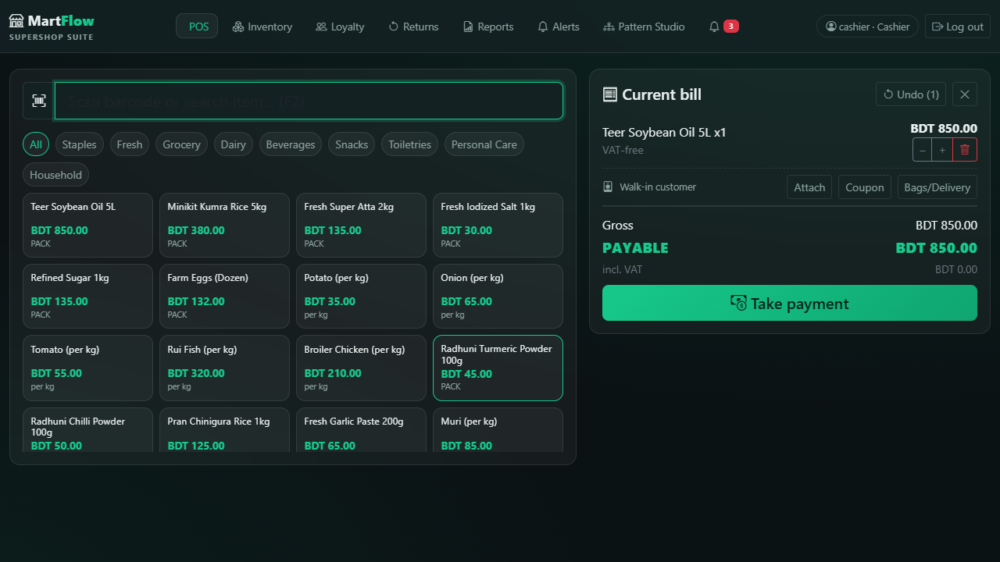
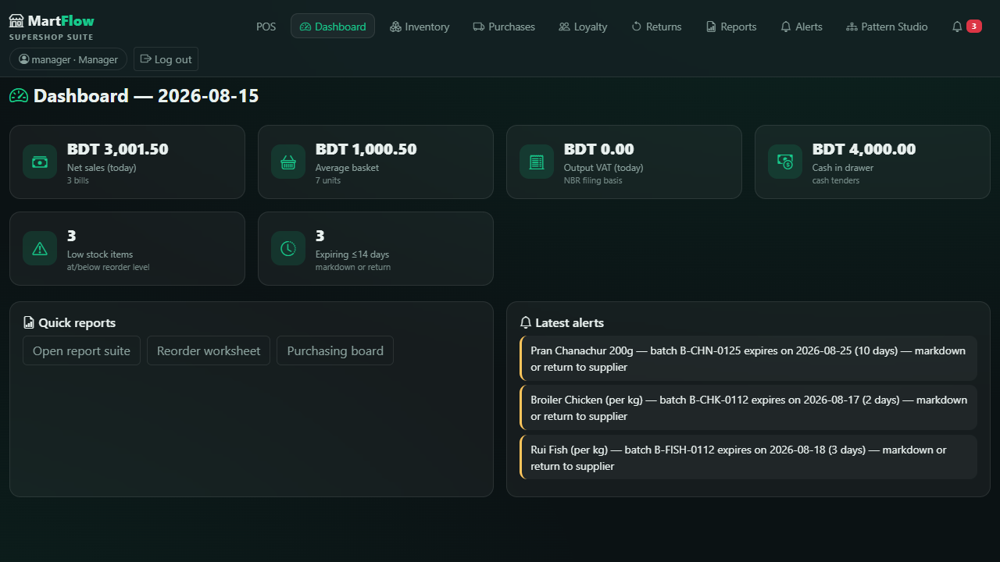
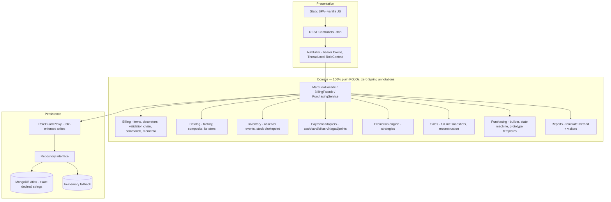
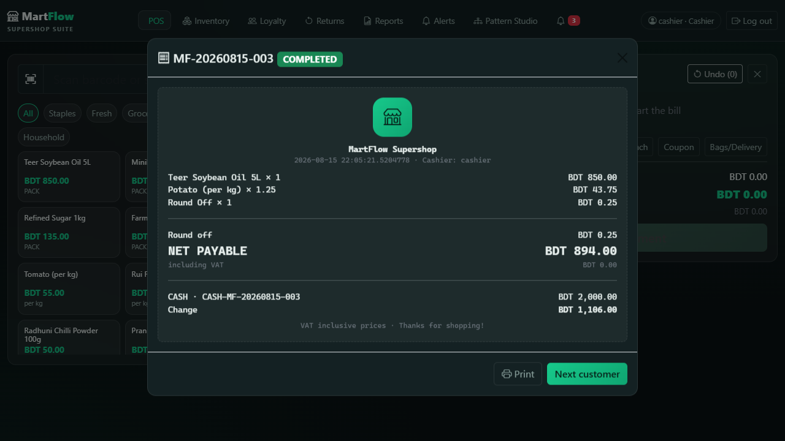
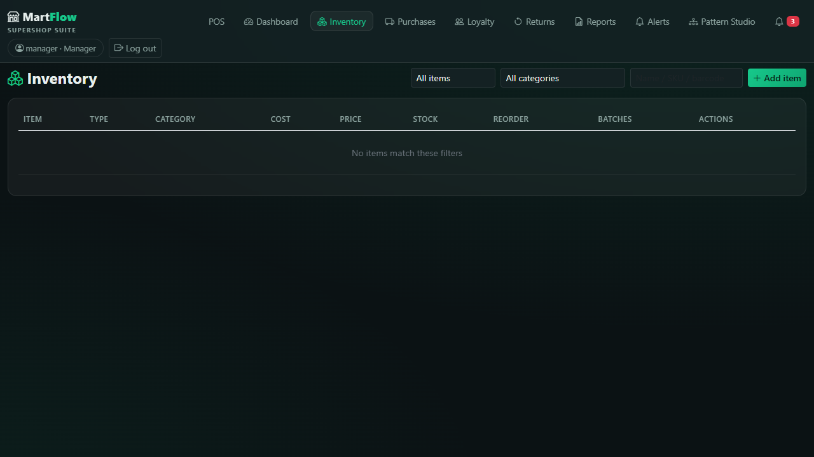
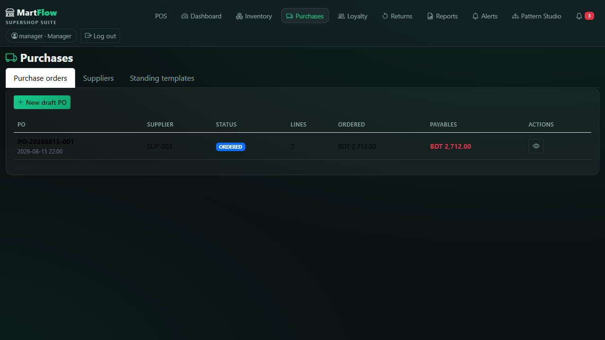
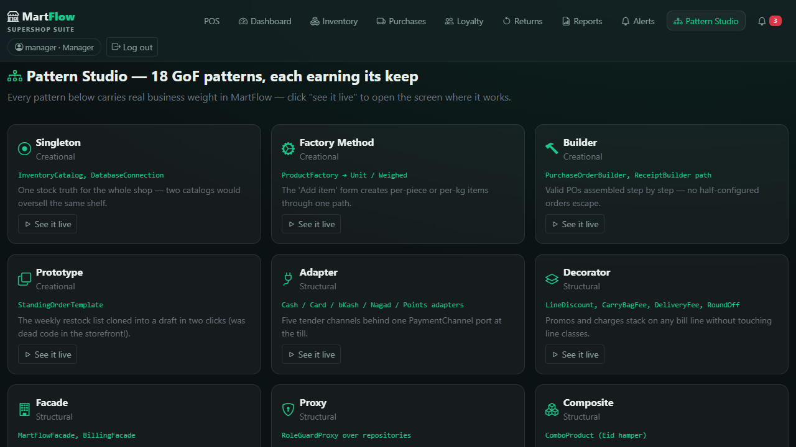

# MartFlow — Supershop Retail Management Suite

**POS · Inventory · Purchasing · Loyalty · Returns · NBR VAT Reports** — a complete retail
management system for Bangladeshi supershops, built in plain Java with 18 GoF design patterns
doing real work in the money path.




---

## The problem MartFlow solves

Bangladeshi supershops (the Shwapno / Meena Bazar / Unimart class, plus hundreds of mid-size
local chains) run their shops on a patchwork: imported POS software that doesn't understand
Bangladesh VAT, spreadsheets for purchasing, notebooks for loyalty, and nothing at all for
wastage. The owner finds out about problems weeks late — stock that walked out the door,
batches that expired on the shelf, margins that quietly eroded.

MartFlow is the single system a supershop branch actually needs:

| Module | What the shop gets |
|---|---|
| **POS billing** | Barcode scanning, weighed goods (per kg), combos/hampers, split tenders (cash / card / bKash / Nagad / loyalty points), one-tap undo for mis-scans, printable thermal receipts (Enter → next customer) |
| **Inventory** | Cost + MRP per item, batch and expiry tracking, reorder levels, low-stock and expiring views, damage/loss/theft write-offs (shrinkage tracking) |
| **Purchasing** | Suppliers with payment terms, purchase orders with a guarded lifecycle, goods receipts that land stock + batch + updated cost on the shelf (with an immediate expiry check), payables, **weekly restock templates** (clone → adjust → submit) |
| **Promotions** | Date-windowed category sales, loyalty member pricing, coupon codes — full manager CRUD + a live coupon tester, applied by the till automatically |
| **Loyalty** | Members by phone, points earned per 100 BDT, points redeemed as tender at the till |
| **Returns** | Partial per-line returns with pro-rata refunds through the original channel, void with full reversal, exchange = return + new bill |
| **Sales explorer** | Manager view over every receipt: date/status/cashier filters, one-click reprint, void with a required reason |
| **Day close (Z-report)** | End-of-shift drawer reconciliation — per-tender split, expected vs counted cash, variance, printable Z-slip; a sale sold yesterday but voided today charges today's drawer, not yesterday's closed Z |
| **Activity log** | Append-only audit trail: every login (incl. failed), void, return, shrinkage, price edit, promotion change, PO move and staff change with its actor — "ke void dilam?" has an answer |
| **Reports** | Daily sales, best sellers, reorder worksheet, wastage watch, staff performance, **profit (revenue vs cost)**, and the **NBR VAT summary** — every report exportable to CSV |
| **Developer Mode** | A fourth login for the examiner: 18 pattern deep-dives with real source snippets and the test that proves each, a live API explorer (try-it with your own token, 403s included), and system diagnostics — visible **only** to the developer account |
| **Access control** | Real login (PBKDF2-hashed passwords, bearer tokens), four roles: owner / manager / cashier / developer — a cashier physically cannot reprice the till or read the margins; the developer gets the till-side screens but no business power |

Everything persists to **MongoDB Atlas** (with a zero-config in-memory fallback for demos), and
every money figure is exact-decimal `BigDecimal` — prices are VAT-inclusive the way Bangladeshi
shelves actually work, with output VAT back-calculated per NBR rate slab (0% / 7.5% / 15%).

---

## Quick start

Requirements: **JDK 17+** (Maven wrapper included — no Maven install needed).

```powershell
.\mvnw.cmd spring-boot:run          # in-memory mode, zero setup
# open http://localhost:8080
```

**Demo accounts** (seeded on first boot — change them before any real use):

| Username | Password | Role |
|---|---|---|
| `admin` | `admin123` | Owner — everything, incl. staff accounts & item deletion |
| `manager` | `manager123` | Manager — catalog edits, purchasing, financial reports, voids, day close |
| `cashier` | `cashier123` | Cashier — billing, returns, operational views |
| `developer` | `developer123` | Developer — till-side screens + **Developer Mode** (patterns / API explorer / diagnostics); no business power |

First boot seeds a realistic BD shelf (Teer, Fresh, Pran, Radhuni, Miner…), 3 distributors,
active promotions, 5 loyalty members and a purchase order already on its way — so every screen
has something real to show.

### Optional: persistent storage (MongoDB Atlas)

Create a free Atlas cluster, then set `MONGODB_URI` (env var or a `.env` file — see
`.env.example`). When Atlas is reachable the app persists everything — restart mid-day and
your sales, stock, points and purchase orders survive; a restart drill is part of the test
plan. No URI? Everything still runs in-memory.

### Tests

```powershell
.\mvnw.cmd clean test               # 167 tests, fully hermetic (no real DB is ever touched)
```

---

## The 18 GoF patterns — and the business reason each one exists

This project began as a patterns lab and was rebuilt into a product; the rule throughout was
**a pattern earns its place only by carrying a real feature**. Three patterns that were dead
code in the old storefront (Prototype, TaxVisitor, the customer Observer) are now load-bearing.

| # | Pattern | Where | Why the business needs it |
|---|---|---|---|
| 1 | **Singleton** | `catalog/InventoryCatalog`, `persistence/DatabaseConnection` | One stock truth per process — two catalogs would oversell the same shelf |
| 2 | **Factory Method** | `catalog/ProductFactory` → `UnitProductFactory`, `WeighedProductFactory` | The "add item" form creates per-piece and per-kg items through one path |
| 3 | **Builder** | `suppliers/PurchaseOrderBuilder` | A PO is assembled step by step; no half-configured order can escape into the workflow |
| 4 | **Prototype** | `suppliers/StandingOrderTemplate` | The weekly restock list is a template — *clone into draft, adjust, submit* (2 clicks instead of 15) |
| 5 | **Adapter** | `payment/` — Cash, Card, Bkash, Nagad, Points adapters over vendor-shaped SDKs | Five very different tender channels behind one `PaymentChannel` port; the till code never branches on payment type |
| 6 | **Decorator** | `billing/decorator/` — LineDiscount, CarryBagFee, DeliveryFee, RoundOffAdjustment | Promotions and charges stack on any bill line without touching the line classes; cash totals round to whole taka |
| 7 | **Facade** | `app/MartFlowFacade`, `billing/BillingFacade` | Every UI button is one call; controllers stay dumb and testable |
| 8 | **Proxy (protection)** | `persistence/proxy/RoleGuardProxy` over the repositories | A cashier cannot create/delete catalog items *even through a buggy endpoint* — enforced at the data boundary, not the UI |
| 9 | **Composite** | `catalog/ComboProduct` | An Eid hamper is priced and stocked from its components; selling one consumes each component truthfully |
| 10 | **Observer** | `inventory/` — AlertService, ReorderSuggestionObserver, ExpiryWatcher | Low stock, near-expiry batches and wastage raise alerts by themselves; low stock even drafts the reorder suggestion |
| 11 | **Strategy** | `pricing/` — RegularPrice, CategorySale, MemberPrice + `PromotionEngine` | Managers switch promotions on/off per date window; the till's pricing code never changes |
| 12 | **Command** | `billing/commands/` + void/return pipelines | Tender is a transaction: a **declined card rolls back stock, points and the sale itself**, in reverse order — atomically |
| 13 | **Template Method** | `reports/AbstractReportGenerator` + 8 concrete reports | A new report is 3 hooks; "VOIDED never counts as revenue" is decided exactly once |
| 14 | **Chain of Responsibility** | `billing/validation/` — 6 ordered rules | The cashier sees the *exact first* failing rule (empty bill → weighment → stock → coupon → loyalty → tender) |
| 15 | **State** | `suppliers/postate/` — 6 purchase-order states | A draft PO physically cannot be received; a closed one cannot be cancelled — the states guard themselves |
| 16 | **Visitor** | `reports/visitor/` — VatVisitor, ProfitVisitor, ReceiptFormatterVisitor | The same bill lines feed NBR VAT filing, margin analysis and receipt layout — including sales reloaded from Mongo |
| 17 | **Memento** | `billing/BillMemento` (per-session undo stack) | Mis-scans happen every minute at a real till; the cashier's Undo is a money feature |
| 18 | **Iterator** | `catalog/iter/` — InStock, LowStock, ExpiringSoon, PriceRange | The low-stock *view* and the low-stock *report* walk the same iterator — they can never disagree |

**One deliberate asymmetry:** POS sale status is a plain enum while purchase orders get the
full State pattern. A sale has no long-lived per-status behaviour (void and return are one-shot
operations with their own commands), whereas a PO sits for days in states with genuinely
different allowed operations. Patterns follow the domain, not the syllabus.

**Still exactly 18 after the v1.1 features** — the audit trail and the Z-report were both
evaluated for Observer / Template Method and *rejected* on the merits (the stock observers carry
no actor or intent; the report template's "VOIDED never counts" invariant is exactly what a
Z-report must break). The rejection rationale is written into each service's javadoc — the
"why not" is part of the answer.

## Architecture



**Layer rule:** the domain is 100% plain POJOs with no framework annotations; Spring appears
only in one `@Configuration` (`AppConfig` builds the whole object graph) and thin HTTP
controllers. That separation is what keeps the patterns honest and the domain unit-testable.

**Money rule:** every amount is `BigDecimal` (2dp, HALF_UP, one `MoneyUtil` choke point),
persisted as exact decimal strings. VAT is inclusive with NBR back-calculation
(`vat = net × rate / (100 + rate)`) in one shared `VatCalculator`. All business dates flow
through `TimeSource` pinned to **Asia/Dhaka**.

**Durability:** stock, sales, customers, promotions, purchase orders, suppliers and users all
persist to Atlas when configured. Tokens are in-memory (a restart logs staff back in — data
never lost); the alert feed is deliberately ephemeral and capped.

## API surface (all under `/api`, bearer token required except login)

<details>
<summary><b>Click to expand the complete endpoint list</b></summary>

| Area | Endpoints |
|---|---|
| Auth | `POST /auth/login` · `POST /auth/logout` · `GET /auth/me` |
| Staff (admin) | `GET/POST /users` · `PUT /users/{id}` |
| Catalog | `GET /products?q&categoryId&view=in_stock\|low_stock\|expiring&days&maxPrice` · `GET /products/{id}` · `GET /products/barcode/{code}` · `GET /categories` · `POST/PUT /products/{id}` (manager+) · `DELETE` (admin) · `POST /products/{id}/restock` · `POST /products/{id}/adjust` (DAMAGE/LOSS/THEFT/COUNT) |
| POS bill | `GET /bill` · `POST /bill/lines` · `PUT/DELETE /bill/lines/{index}` · `DELETE /bill` · `POST /bill/undo` · `PUT /bill/customer` · `PUT /bill/coupon` · `PUT /bill/charges` · `POST /bill/tender` |
| Sales | `GET /sales?from&to&status&cashier` (manager+) · `GET /sales/{receiptNo}` (reprint) · `POST /sales/{receiptNo}/void` (manager+) |
| Returns | `POST /sales/{receiptNo}/returns` · `GET /returns` (manager+) |
| Promotions | `GET /promotions` · `POST/PUT/DELETE /promotions[...]` (manager+) · `POST /promotions/validate` |
| Loyalty | `GET /customers?q` · `POST /customers` · `GET /customers/{id}` · `POST /customers/{id}/points/adjust` (manager+) |
| Purchasing (manager+) | `GET/POST /suppliers` · `GET/POST /purchase-orders` · `GET /purchase-orders/{id}` · `POST .../submit\|cancel\|receive\|payments\|close` · `POST /purchase-orders/from-template` · `GET/POST /purchase-orders/templates` |
| Reports | `GET /reports/{daily-sales\|best-sellers\|low-stock\|expiry\|returns\|staff\|profit\|vat}?from&to&format=json\|csv` (financial ones manager+) · `GET /reports/dashboard` · `GET /reports/day-close/preview` · `POST /reports/day-close` · `GET /reports/day-close` (all manager+) |
| Alerts | `GET /alerts?unreadOnly` · `POST /alerts/{id}/read` |
| Audit (manager+) | `GET /audit?from&to&actor&action&limit` |
| Developer Mode (developer only) | `GET /dev/patterns` · `GET /dev/endpoints` · `GET /dev/system` |

</details>

## Quality engineering (the unglamorous part that makes it a product)

- **Automated tests for every money path** (see the count above), fully hermetic (the suite pins
  an invalid `MONGODB_URI` so a developer's local `.env` can never leak a live database into a
  test run).
- **Drift-guarded documentation:** the Developer Mode pattern catalog cites real classes, real
  tests and real source snippets — a test walks the source tree and fails the build if a card
  ever cites a class that doesn't exist (this is the guard that would have caught the old
  "ReceiptBuilder" ghost). A second guard asserts the API explorer's catalog equals Spring's
  registered routes in both directions.
- **Drawer math that reconciles by hand:** the Z-report's `expected = cashIn − changeOut −
  cashRefunds − voidCashOut`, with the change subtraction and the cross-midnight void each
  pinned by dedicated tests. (The dashboard's "cash tendered" tile deliberately shows raw cash
  tenders — the Z-report is the reconciled number.)
- Persistence drills against real Atlas: make a sale → restart the app → the reprint is
  byte-identical and stock, points and PO state survived.
- Sale lines are **self-contained snapshots** — a receipt reloaded from Mongo reconstructs
  into the exact same item chain, so reprints and VAT filings can never drift from what was
  charged (the classic bug this replaces: orders losing their item types on persistence).
- Role context is a `ThreadLocal` cleared in a `finally` — the old process-wide role flag
  raced under concurrent requests.
- Lenient enum parsing everywhere a list could meet a hand-edited value: one bad status can
  never 400 an entire sales list.

## Screenshots

| | |
|---|---|
|  |  |
|  |  |
|  |  |

The in-app **Developer Mode** (developer login only) links every one of the 18 patterns to the
exact screen where it works, shows the real source snippet and the green test that proves it,
and lets you fire any API route with your own token — the demo writes itself.

## Roadmap (what v2 would add)

Multi-branch sync · offline-first billing with background reconciliation · real bKash/Nagad
merchant API integration (the adapters already isolate the vendor shape) · barcode-printer and
cash-drawer hardware · customer purchase-history analytics · purchase-order approval flows.
(v1.1 already shipped the accountability layer this roadmap assumed: audit trail, day-close
Z-report, promotions manager, sales explorer and Developer Mode.)

## Contributors

- **MD Mahamudul Hasan** ([@MHMITHUN](https://github.com/MHMITHUN)) — Lead Developer & System Architect
- Sumya Soma ([@sumyasoma](https://github.com/sumyasoma))
- Alfa Sany ([@AlfaSany](https://github.com/AlfaSany))

## License

MIT — see [LICENSE](LICENSE).
